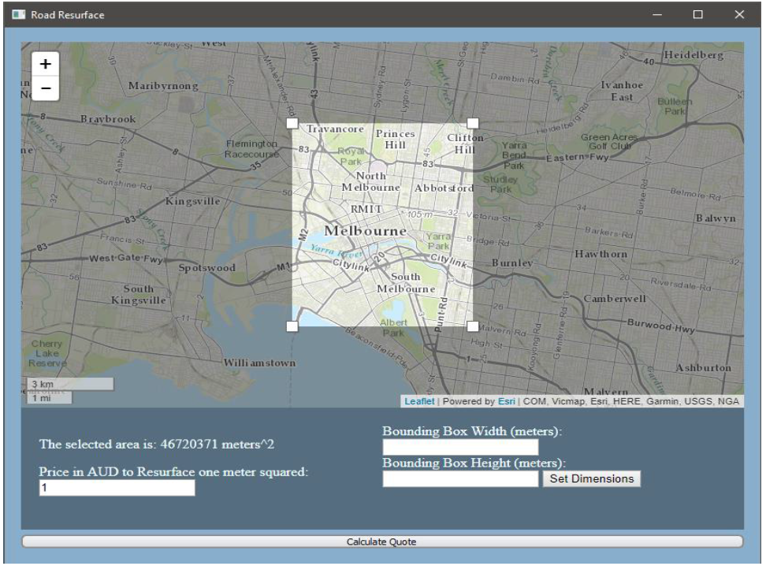
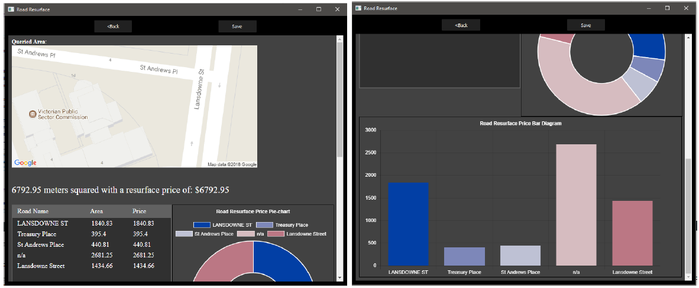

# Road Surface Area Estimation - Computer Science Project
Project for Monash University unit FIT3036 ( Computer Science Project ), 2018

## Project Motivation
Produce an easy-to-use program that would allow city councils in Victoria, Australia to estimate the cost of resurfacing roads without manual labour.
To achieve this, the program uses PyQt to produce an elegant and easy-to-use GUI and openstreetmap as well as victorian databases to estimate the cost of resurfacing roads within a user designated arae.

## Quick Start
Navigate to the Application folder 
``py main.py``

### Prerequisites
0. Python 3.6 or higher
1. PyQt 5.1 - used for GUI - `pip3 install pyqt5`
2. Overpy - used to access openstreetmap using Overpass API - `pip3 install overpy`
3. numpy - maths - `pip3 install numpy`
4. [leaflet-areaselect](https://github.com/heyman/leaflet-areaselect)

Extra: A google maps API key for the results page. Optional.

## Introduction - taken from report/Final_Report.pdf

The project outlined in this report follows a scenario where a local city council requests the development of a software package capable of estimating the cost of resurfacing all roads in a designated 1 km2 area with the following requirements 

• Access to Google maps or another mapping service to select an area. • Flexibility when selecting an area, i.e. the ability to move around the selected area. 

• An elegant and friendly user interface as the application would be used by local council contractors and employees. 

• The project needs to function within Victoria, Australia. 

Currently, the way that this estimation process is done is through manual labour. The current method is not only cost, it can also cause a disturbance to the road network as certain roads might need to be closed for a short period of time in order to be measured. This project provides a cheaper and easier alternative. 

To achieve the requirements and deliver satisfactory and usable software, the project was completed using various technologies. The frontend of the project was developed using PyQt5, HTML, CSS and JavaScript; while the backend of the project was implemented in Python. The implementation style that best fit the constraints involved using OpenStreetMaps (OSM) and VicRoads Opendata as a source of data

Additional information such as calculations and implementation can be found in reports/Final_Report.pdf
